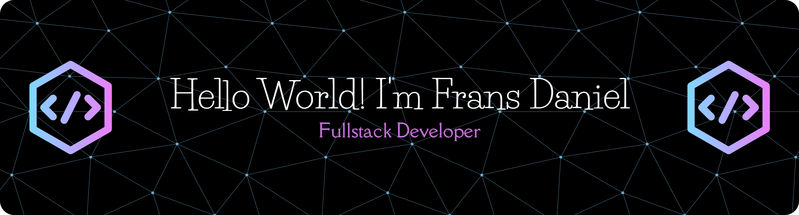

<!--
**FransDaniel-git/FransDaniel-git** is a ✨ _special_ ✨ repository because its `README.md` (this file) appears on your GitHub profile.

Here are some ideas to get you started:

- 🔭 I’m currently working on ...
- 🌱 I’m currently learning ...
- 👯 I’m looking to collaborate on ...
- 🤔 I’m looking for help with ...
- 💬 Ask me about ...
- 📫 How to reach me: ...
- 😄 Pronouns: ...
- ⚡ Fun fact: ...
-->

  

#### About Me

🎓 Currently studying Informatics (Computer Science)

🌱 Actively learning Web Development, Mobile Development, and Databases

🛠️ Interested in building real-world web and mobile applications

📚 Passionate about solving problems with clean and efficient code

♟️ Enjoy playing chess to sharpen problem-solving skills, strategic thinking, and quick decision-making

#### Languages & Tools I Use

#### Connect With Me

  
  
  

###

#### XD

###
